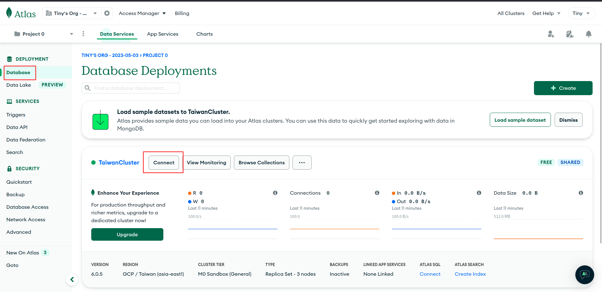
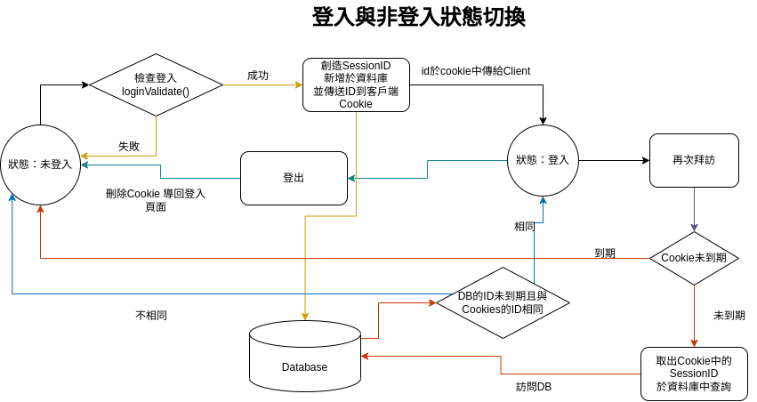
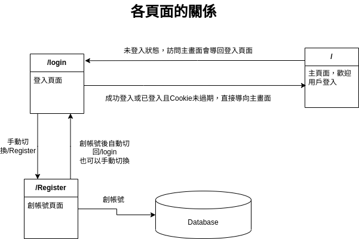

# Readme

## 簡介
本專案嘗試利用Cookie手刻登入畫面，後端僅使用cookie-parser套件，前端使用fetch代替form，不使用express-session與passport套件，暫不考慮安全性問題。

## Installing - 專案安裝流程

1. 請先確認有安裝 node.js 與 npm
2. 創造一個專案資料夾，打開您的 terminal，使用`cd`指令進入您剛創建的資料夾
3. Clone 此專案至本機電腦將專案 clone 到本地
    ```bash
    git clone https://github.com/TinyMurky/simple_login.git
    ```
4. 在本地開啟之後，透過終端機進入資料夾，輸入：
    ```bash
    npm install
    ```
5. 我們需要連結到MongoDB，您需要先於[MongoDB](https://www.mongodb.com/)建立您的Cluster，並於畫面左上角的Database=>Connect 取得雲端DB連結。

    
6. 建立Cluster後，在本專案的根目錄中建立`.env`檔案，並於其中輸入連接您的資料庫，請把以下的`<>`內的資訊替代成您的資訊（`<>`不需要留）
    ```
    mongodb+srv://<您的帳號名稱>:<password>@<您的Cluster連結>/users?retryWrites=true&w=majority
    ```
7. 接著建立預設帳號:
    ```bash
    npm run seed
    ```

    使用者資料為: 
    |Name|Email|Password|
    |:---|:----|:-------|
    |Tony|tony@stark.com|iamironman|
    |Steve|captain@hotmail.com|icandothisallday|
    |Peter|peter@parker.com|enajyram|
    |Natasha|natasha@gamil.com|*parol#@$!|
    |Nick|nick@shield.com|password|
8. 建立完後，於終端機輸入：
    ```bash
    npm run start
    ```
9. 若看見此行訊息則代表順利運行，打開瀏覽器進入到以下網址:
    ```bash
    Server localhost:3000 started.
    ```
10. 可以使用第7點的email與密碼登入看看
11. 若欲暫停請於終端機使用:
    ```bash
    ctrl + c
    ```

## 程式邏輯

- 狀態分為登入與未登入
- 未登入時進入`/login`頁面使用`loginValidate()`驗證登入
- 登入成功後實用套件`nanoid`創見隨機字串，存放於Database該登入者之文件作為SessionID，並加上更改時間
- 將sessionID加密後存放於客戶端的Cookies
- 登入後可訪問主畫面
- 再次登入時如果客戶端cookie未到期，解密後比對是否與資料庫sessionID相同，若相同則可以直接登入
- 如果ID比對不符、過期或cookie不存在，進入主畫面時將導回登入頁面
- 可主動登出，將會刪除客戶端cookie並導回登入頁面
## 頁面之間的關係

- login頁面可手動切換至register頁面
- register頁面創帳號成功之後自動回到login，也可手動切換
- login頁面登入成功後自動導向主頁面
- 若cookie存在且sessionID未過期且與Database一致，進入login頁面時直接導向主頁面
- 進入主頁面若是未登入或sessionID比對失敗，自動導回login頁面
- 主頁面可登出，登出時刪除cookie並回到login頁面
## Environment SetUp - 環境建置
- Node.js 18.16.0
- Express 4.18.2
- Express-Handlebars 7.0.7
- dotenv 16.0.3,
- mongoose 7.1.1
- nanoid 4.0.2,
- nodemon 2.0.22
- cookie-parser 1.4.6

